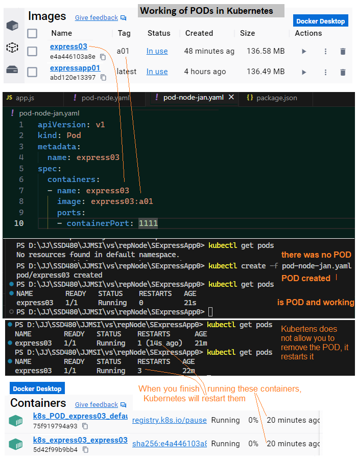
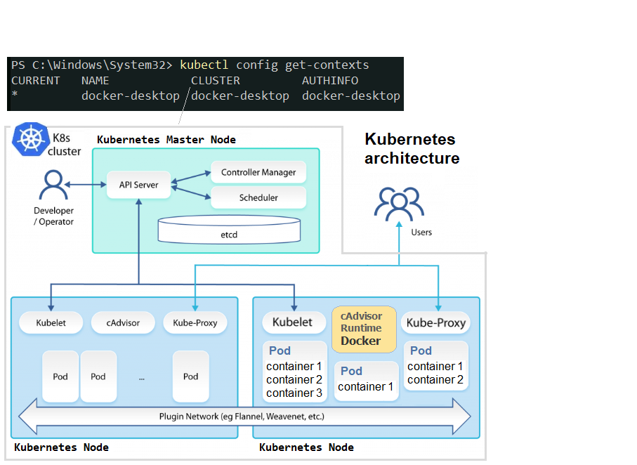

# Web applications in Kubertenes

Creating Node, POD and containers for web applications in Kubertenes.

## Description
The application presents settings and configurations for creating Node, POD and containers and running the application under Kubertenes control.
After running the application in a container and POD, Kubertenes mechanisms flexibly allocate defined resources to the application and ensure operational reliability. In the event of a failure, the POD is removed and the application is immediately resumed in the new POD. Kubernetes also provides many other CI/CD mechanisms.

.

.

